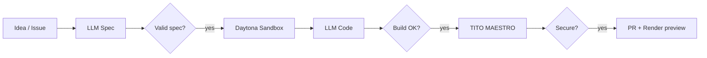

# SuperPlane NYC Hackathon — Software Factory

Aligned with the official theme: [**Build Your Own Software Factory**](https://docs.google.com/document/d/151kAyQbpLdWKggWLMBPtjABEOaIN4h4gsBHOwthCN_s/edit).

## Theme requirements → how we meet them

| Requirement | Implementation |
|-------------|----------------|
| Input is a vague idea or rough feature description | Manual **Feature Request** trigger (free text) or GitHub issue # |
| LLM agents handle speccing, coding, verifying | `openai.textPrompt` nodes for spec + implementation; sandbox verify step |
| Each stage validates the previous worked | `validate-spec` → build gate → TITO gate → PR only after push succeeds |
| Final output is a working PoC on a preview env | **Render** PR previews (Manual mode, `[render preview]` title) |
| Preview link on the pull request | Render `deploy_ended` webhook → SuperPlane → PR comment (+ CI fallback) |

## Validation issues

Your factory must produce PoCs for these [superplanehq/superplane](https://github.com/superplanehq/superplane) issues:

| Issue | Title |
|-------|-------|
| [#5368](https://github.com/superplanehq/superplane/issues/5368) | Markdown view mode (mermaid.js, node mention chips) |
| [#5366](https://github.com/superplanehq/superplane/issues/5366) | Canvas version diff highlighting |
| [#5164](https://github.com/superplanehq/superplane/issues/5164) | Send execution to agent chat |
| [#5704](https://github.com/superplanehq/superplane/issues/5704) | Run inspection UX paper cuts |
| [#5705](https://github.com/superplanehq/superplane/issues/5705) | Canvas warnings improvements |

### Quick launch

In SuperPlane → **Feature Request** → template **Run factory on GitHub issue #** → enter `5368` (or any issue above).

Or comment `/factory` on an issue in `superplanehq/superplane` (requires GitHub integration).

## Pipeline



## Render setup ($50 credit)

```bash
./scripts/setup-render.sh
```

1. [dashboard.render.com](https://dashboard.render.com/) → **New → Blueprint** → this repo
2. **software-factory** → **Previews** tab → **Manual** (saves credit vs automatic)
3. SuperPlane → Integrations → **Render** — webhooks auto-register ([dashboard](https://dashboard.render.com/webhooks))
4. `.github/workflows/render-preview.yml` — fallback if webhooks are slow

**Budget:** starter plan ≈ $7/mo base + PR previews prorated by the second, deleted when PR closes.

For **superplanehq/superplane** PoCs: fork the repo, deploy the web service on Render, enable Manual PR previews, set `target_repository` in params.

## Required SuperPlane integrations

Connect in **Settings → Integrations**, then copy IDs into `superplane/params.json`:

| Integration | Used for |
|-------------|----------|
| **GitHub** | Issue comments, create PR, preview comment |
| **OpenAI** | Spec + implementation LLM steps |
| **Daytona** | Sandbox, build verify |
| **Render** | PR preview hosting (dashboard + optional SuperPlane integration) |

```json
{
  "target_repository": "superplanehq/superplane",
  "github_integration_id": "<from integrations list>",
  "openai_integration_id": "<from integrations list>",
  "daytona_integration_id": "<from integrations list>",
  "render_service_name": "software-factory"
}
```

```bash
superplane integrations list -o yaml
```

## Security layer (differentiator)

**TITO + MAESTRO** runs inside the sandbox before any PR is created — agentic AI threats are classified per the [CSA MAESTRO framework](https://cloudsecurityalliance.org/blog/2026/02/11/applying-maestro-to-real-world-agentic-ai-threat-models-from-framework-to-ci-cd-pipeline). Critical findings block the pipeline.

CI also runs TITO on every PR via `.github/workflows/tito-maestro.yml`.

## Demo script (5 min)

1. Show canvas — point out LLM nodes and validation gates
2. Trigger issue **#5368** from Feature Request
3. Walk a run: spec → sandbox → verify → TITO → PR → Render preview URL comment
4. Repeat for one more issue to show it generalizes
5. Mention MAESTRO as the security guardrail for agent-heavy factories

## Deploy checklist

- [ ] SuperPlane connected (`superplane whoami`)
- [ ] Render Blueprint deployed, Manual PR previews enabled
- [ ] GitHub, OpenAI, Daytona integrations connected
- [ ] `params.json` integration IDs filled in
- [ ] Canvas draft published in SuperPlane
- [ ] Fork or branch access to `superplanehq/superplane` for pushes
