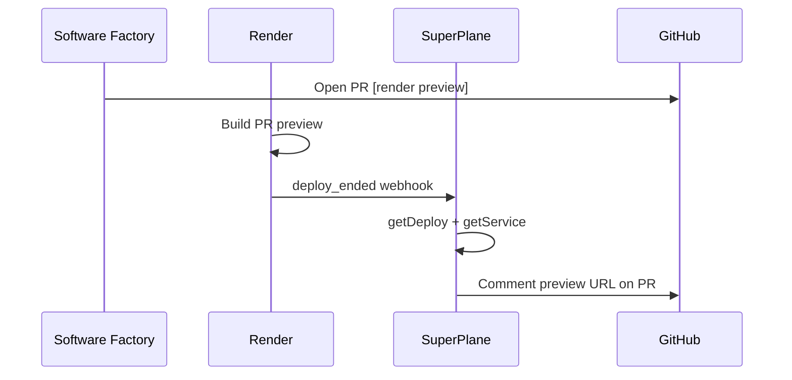

# Render Webhooks + Software Factory

The factory posts the **live preview URL on the PR** when Render finishes deploying, using `deploy_ended` webhooks.

## Recommended: SuperPlane Render integration (auto webhooks)

1. Connect **Render** in SuperPlane (API key from Account Settings)
2. Add the **On Render Deploy** node on the canvas (already in `canvas.yaml`)
3. SuperPlane registers the webhook automatically — verify at [dashboard.render.com/webhooks](https://dashboard.render.com/webhooks)

No manual webhook URL copy/paste needed.

## Manual: Render dashboard webhooks

Use this if you want full control or aren't using the SuperPlane Render integration:

1. [dashboard.render.com/webhooks](https://dashboard.render.com/webhooks) → **+ Create Webhook**
2. **Events:** `deploy_ended` (optionally `build_ended` for earlier signal)
3. **URL:** SuperPlane webhook URL from your app's Webhook trigger node

Render sends a thin JSON payload:

```json
{
  "type": "deploy_ended",
  "data": {
    "serviceId": "srv-...",
    "serviceName": "software-factory",
    "status": "succeeded"
  }
}
```

SuperPlane validates `webhook-signature` per [Render's protocol](https://render.com/docs/webhooks).

## Canvas flow



## Requirements

| Item | Notes |
|------|-------|
| Render Pro+ | Webhooks require Professional plan or higher |
| `render_integration_id` | In `superplane/params.json` |
| `render_service_id` | Your software-factory service ID |
| GitHub secret | `github-token` in SuperPlane for PR lookup |

## Fallback

`.github/workflows/render-preview.yml` polls GitHub Deployments if the webhook path is unavailable.
